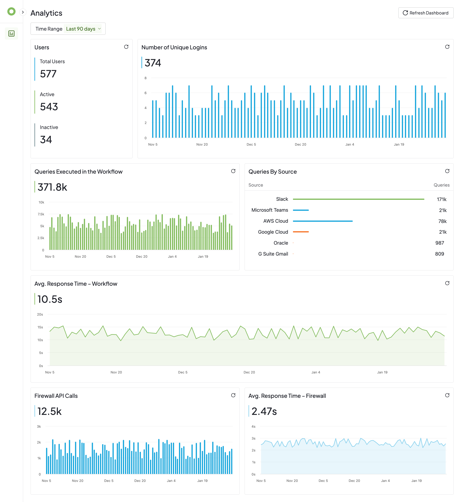
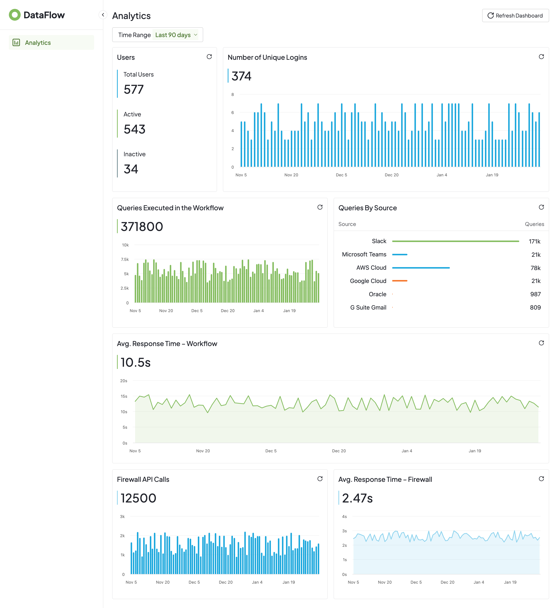
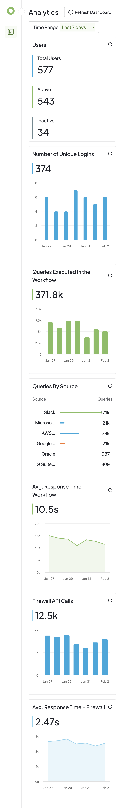

# Analytics Dashboard Page

A analytics dashboard page built with React, TypeScript and Tailwind CSS that displays key metrics and visualizations for monitoring user activity, query execution, and system performance. Made as part of the Frontend Home Assignment – Dashboard
Page for securiti.ai

## Table of Contents

- [Project Overview](#project-overview)
- [Tech Stack](#tech-stack)
- [Setup Instructions](#setup-instructions)
  - [Prerequisites](#prerequisites)
  - [Installation](#installation)
- [API Endpoints](#api-endpoints)
- [Key Decisions and Trade-offs](#key-decisions-and-trade-offs)
  - [TanStack Query (React Query)](#tanstack-query-react-query)
  - [Tailwind CSS](#tailwind-css)
  - [Highcharts](#highcharts)
  - [Context API (for Time Period)](#context-api-for-time-period)
  - [TypeScript](#typescript)
  - [JSON Server](#json-server)
  - [Accessibility](#accessibility)
- [What I Would Improve With More Time](#what-i-would-improve-with-more-time)
- [Approximate Time Spent](#approximate-time-spent)
- [UI Screenshots](#ui-screenshots)

## Project Overview

This dashboard provides a comprehensive view of system analytics including:

- User statistics (total, active, inactive users)
- Unique login trends over time
- Query execution metrics
- Queries by source breakdown
- Average response times for workflow and firewall APIs
- Firewall API call volumes

The dashboard features a collapsible sidebar navigation, period filtering (7, 30, or 90 days), and responsive grid layouts that adapt to different screen sizes.

## Tech Stack

- **React 19** - UI library
- **TypeScript** - Type-safe JavaScript
- **Vite** - Build tool and dev server
- **TanStack Query (React Query)** - Server state management
- **Tailwind CSS** - Utility-first CSS framework
- **Highcharts** - Charting library
- **JSON Server** - Mock REST API
- **Context API** - Client state management

## Setup Instructions

### Prerequisites

- Node.js (v18 or higher)
- npm or yarn (v9 or higher)
- Git (for version control)

### Installation

1. Clone the repository:

   ```bash
   git clone <repository-url>
   cd analytics-dashboard
   ```

2. Install dependencies:

   ```bash
   npm install
   ```

3. Start the mock API server:

   ```bash
   npm run server
   ```

   This starts JSON Server on `http://localhost:8000`

4. In a separate terminal, start the development server:
   ```bash
   npm run dev
   ```
   The app will be available at `http://localhost:3000`

## API Endpoints

The mock API (JSON Server) exposes the following endpoints:

| Endpoint                       | Description                      | Query Parameters                          |
| ------------------------------ | -------------------------------- | ----------------------------------------- |
| `GET /overview`                | Dashboard summary statistics     | None                                      |
| `GET /uniqueLogins`            | Unique login time series data    | `timestamp_gte`, `timestamp_lte`, `_sort` |
| `GET /queriesExecuted`         | Query execution time series data | `timestamp_gte`, `timestamp_lte`, `_sort` |
| `GET /queriesBySource`         | Queries grouped by source        | None                                      |
| `GET /avgResponseTimeWorkflow` | Workflow response time series    | `timestamp_gte`, `timestamp_lte`, `_sort` |
| `GET /firewallApiCalls`        | Firewall API calls time series   | `timestamp_gte`, `timestamp_lte`, `_sort` |
| `GET /avgResponseTimeFirewall` | Firewall response time series    | `timestamp_gte`, `timestamp_lte`, `_sort` |

### Example Request

```bash
# Get unique logins for the last 30 days
GET /uniqueLogins?timestamp_gte=1767225600000&timestamp_lte=1769904000000&_sort=timestamp
```

## Key Decisions and Trade-offs

### TanStack Query (React Query)

**Why:** Provides server state management with built-in automatic caching, background refetching, and stale data management. It handles loading/error states, which eliminates the need to manually manage such states. It allows for direct refetching and cache invalidation of multiple queries, which is highly useful when refreshing the entire dashboard data all at once with a single line of code. The `staleTime` and `refetchInterval` options allow fine-grained control over data freshness without writing additional boilerplate code.

**Trade-off:** Adds bundle size (~12KB gzipped), but the reduction in custom data-fetching code and improved UX through automatic background updates justifies this.

### Tailwind CSS

**Why:** Enables rapid UI development with utility classes directly in JSX. Eliminates context-switching between CSS files and components, reduces CSS bloat through automatic purging of unused styles, and provides a consistent design system out of the box.

**Trade-off:** JSX can become verbose with many utility classes. Mitigated by extracting repeated patterns into reusable components (e.g., `CardHeader`, `VerticalBar`).

### Highcharts

**Why:** A feature-rich charting library with extensive customization options, excellent documentation, and built-in responsiveness. Supports all required chart types (column, area, bar) with consistent styling APIs.

**Trade-off:** Highcharts requires a commercial license for non-personal use and has a larger bundle size compared to lighter alternatives like Chart.js. Chosen for its reliability and comprehensive feature set.

### Context API (for Time Period)

**Why:**

1. **Avoids prop drilling** - No need to pass period filter through intermediate components
2. **Single source of truth** - State lives in one place (the provider)
3. **Easy to extend** - New components simply call `usePeriodFilter()`
4. **Type-safe** - Custom hook throws an error if used outside the provider

**Trade-off:** For more complex global state, a dedicated state management library (Redux, Zustand) might be more appropriate. Context API is sufficient for this use case.

### TypeScript

**Why:** Provides compile-time type checking that catches errors before runtime, improves code documentation through type definitions, and enables better IDE support with autocomplete and refactoring tools. Essential for maintaining a scalable codebase.

**Trade-off:** Initial setup overhead and slightly more verbose code. The long-term benefits in maintainability and developer experience outweigh the initial cost.

### JSON Server

**Why:** Provides a zero-configuration REST API from a JSON file, perfect for frontend development, prototyping, and testing. Supports filtering and sorting out of the box, closely mimicking a real backend.

**Trade-off:** Not suitable for production. Data persistence is file-based and there's no authentication or complex business logic support.

### Accessibility

- All interactive buttons include `aria-label` attributes for screen reader support
- Semantic HTML structure with proper use of `<main>`, `<aside>`, and form labels

## What I Would Improve With More Time

### Backend Server with Node.js/Express and Database

Replace JSON Server with a proper backend using Node.js and Express, connected to a database (PostgreSQL or MongoDB). This would enable:

- Real authentication and authorization
- Complex data aggregations and filtering on the server
- Data validation
- Proper API versioning and error handling
- Scalable data storage
- Potential for real-time update capabilities

### Shared Chart Component

Further refactor the chart components to create a unified `AnalyticsChart` component that accepts configuration props. A shared component would reduce code duplication and make it easier to maintain consistent styling across all charts.

### More Breakpoints for Better Responsiveness

Currently, the dashboard has basic responsive behavior with a single breakpoint at 640px that collapses the grid to a single-column layout on mobile devices. With more time, I would:

- Add intermediate breakpoints (768px, 1024px, 1280px) for tablet and larger screens
- Optimize chart heights and font sizes for each breakpoint
- Add touch-friendly interactions for mobile users
- Test and optimize for common device sizes (iPhone, iPad, common Android devices)

### Additional Filters

Add more filtering options beyond the current period filter, such as filtering by category, region, or user segment. This would provide more thorough insights into the analytics data. However, implementing this would require restructuring the data model to include these additional option and updating the API to support multi-parameter filtering.

### Additional Improvements

- **Unit and integration tests** - Add Jest/Vitest and React Testing Library coverage
- **Error boundaries** - Implement React error boundaries for graceful failure handling
- **Accessibility** - Imporove accessibility for each of the charts through the HighchartsAccessibility module
- **Data export** - Allow users to export chart data as CSV/PDF

## Approximate Time Spent

| Task                                                    | Time          |
| ------------------------------------------------------- | ------------- |
| Project planning, study of Figma design & documentation | 1 hour        |
| Project setup and configuration                         | 0.5 hour      |
| Sidebar and layout components                           | 1 hours       |
| Dashboard grid and card components                      | 3 hours       |
| Chart implementations with Highcharts                   | 2 hours       |
| Data fetching with TanStack Query                       | 1.5 hours     |
| Responsive design and styling                           | 2 hours       |
| Refactoring and code optimization                       | 0.5 hours     |
| Documentation                                           | 0.5 hours     |
| **Total**                                               | **~12 hours** |

## UI Screenshots

### Desktop

<br /><br />


### Mobile



---
